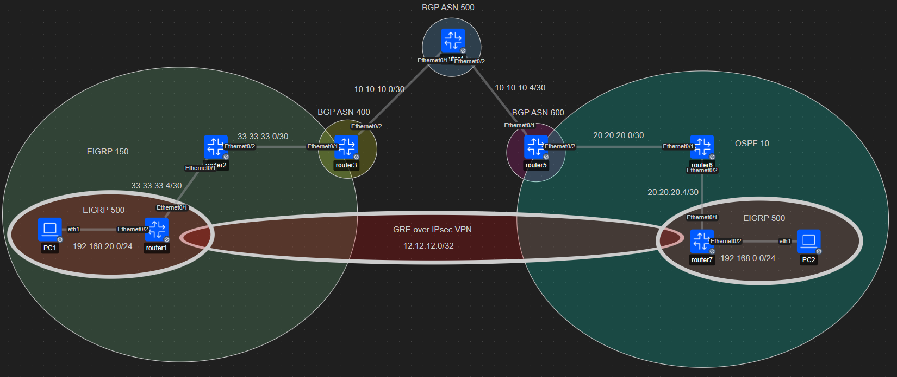
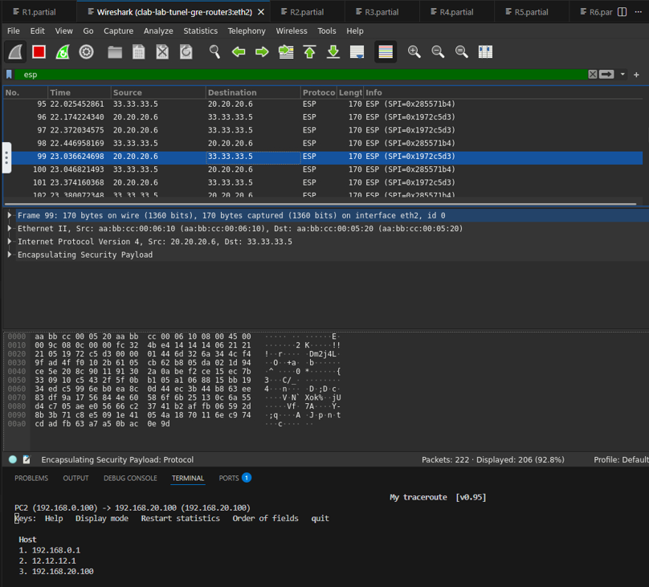

# Interconexión Segura: Túnel GRE sobre IPsec VPN (Cisco IOL)

Este repositorio contiene un escenario avanzado de redes diseñado en **Containerlab**. Se implementa un túnel **GRE** protegido por **IPsec (VTI-based)** para interconectar dos sitios remotos (R1 y R7) a través de una infraestructura con múltiples Sistemas Autónomos.

## 🌐 Topología y Arquitectura
El laboratorio utiliza una combinación de protocolos de enrutamiento para simular un entorno de ISP real:
* **Core:** BGP y OSPF para el transporte.
* **Overlay:** Túnel GRE con EIGRP 500 para el intercambio de prefijos internos LAN.

## 🛠 Detalles de Configuración (Security Stack)
La seguridad del túnel se basa en un perfil de protección IPsec con los siguientes parámetros técnicos:

* **IKEv1 (ISAKMP) Policy 10:** AES-256, SHA-256, Group 14 (DH).
* **IPsec Transform-Set:** `esp-aes 256` y `esp-sha256-hmac`.
* **MTU Tuning:** Ajuste de `ip mtu 1400` en la interfaz `tunnel 1` para evitar fragmentación debido al overhead de GRE e IPsec.

---

## 🔍 Validación y Evidencias Técnicas

### 1. Análisis de Tráfico Encapsulado (Wireshark)

En la captura adjunta, se valida el funcionamiento del protocolo **ESP (IP Protocol 50)**. 

**Análisis técnico:** * Se observa el campo **SPI (Security Parameters Index)**. Este valor es crítico ya que permite a los routers R1 y R7 identificar la asociación de seguridad (SA) correcta para procesar el tráfico cifrado. 
* El tráfico original (ICMP/EIGRP) es totalmente invisible, confirmando que la seguridad `esp-aes 256` está operativa.

### 2. Verificación de Salto Lógico (MTR)
A pesar de que los paquetes atraviesan físicamente varios routers del core, el comando `mtr` desde **PC2** hacia **PC1** muestra una conectividad de "un solo salto" a través de la IP de túnel `12.12.12.1`.

* **Traza lógica:**
    1. `192.168.0.1` -> Gateway (R7)
    2. `12.12.12.1` -> Punto a punto del Túnel GRE (R1)
    3. `192.168.20.100` -> Destino Final

---

## 🚀 Despliegue
1. Clonar el repositorio.
2. Ejecutar: `sudo containerlab deploy -t LAB_TUNEL_GRE.clab.yml`
3. Los archivos de configuración parcial (`.partial`) contienen el stack completo de `crypto isakmp` y `crypto ipsec` utilizado en esta topología.

---
**Autor:** Jhon Colcha - Estudiante de Ingeniería en Telemática (ESPOCH).
