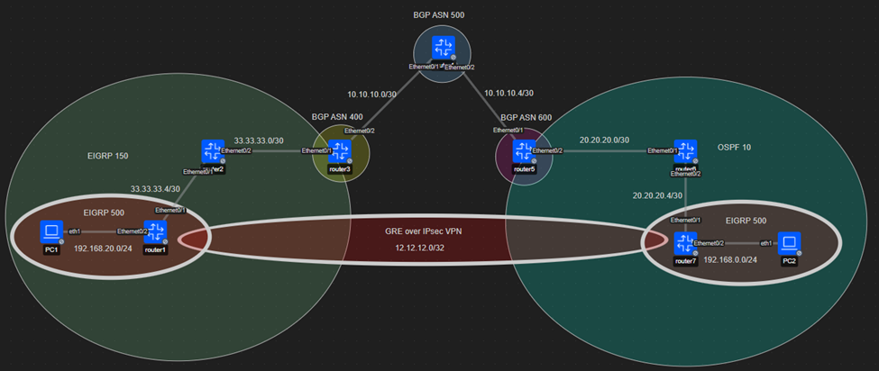

# Implementación de Túnel GRE sobre IPsec VPN (Simulación)

Este proyecto presenta un escenario avanzado de red diseñado en **Containerlab**, enfocado en la interconexión segura de sitios remotos mediante un túnel **GRE (Generic Routing Encapsulation)** protegido por un túnel **IPsec** en modo transporte/túnel, garantizando confidencialidad e integridad de los datos.

## 🌐 Topología del Laboratorio
La arquitectura conecta múltiples Sistemas Autónomos (AS) utilizando BGP y OSPF, con una infraestructura central que simula el transporte seguro.



## 🛠 Tecnologías Utilizadas
* **Orquestación:** [Containerlab](https://containerlab.dev/) & Docker.
* **Enrutamiento:** Cisco IOL / VyOS.
* **Protocolos de Enrutamiento:** BGP (ASN 400, 500, 600), OSPF, EIGRP.
* **Seguridad:** IPsec (Encapsulating Security Payload - ESP).
* **Túneles:** GRE para transporte multiprotocolo.

---

## 🔍 Validación Técnica

### 1. Cifrado de Tráfico (Wireshark)
Para validar la seguridad, se realizó una captura en la interfaz de transporte. Se confirma que el tráfico GRE está encapsulado bajo el protocolo **ESP (IP Protocol 50)**, haciendo que los datos internos sean ilegibles para actores no autorizados en la red de transporte.


*En la imagen se observa el intercambio de paquetes con SPI específicos, confirmando el túnel IPsec activo.*

### 2. Verificación del Túnel (MTR/Traceroute)
Se ejecutó un `mtr` desde **PC2 (192.168.0.100)** hacia **PC1 (192.168.20.100)**. La traza muestra un salto lógico directo a través de la IP del túnel (**12.12.12.1**), ocultando la complejidad de la red física subyacente.

* **Resultado del MTR:**
    1. `192.168.0.1` (Gateway local)
    2. `12.12.12.1` (Extremo remoto del Túnel GRE)
    3. `192.168.20.100` (Destino final)

---

## 🚀 Cómo desplegar este laboratorio

1. **Clonar el repositorio:**
   ```bash
   git clone [https://github.com/Jhon1176/Lab_Tunel_GRE.git](https://github.com/Jhon1176/Lab_Tunel_GRE.git)
   cd Lab_Tunel_GRE
